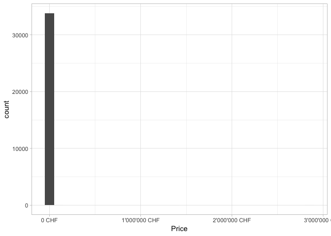

To do:
- change data table to kable
- commit github


# Load

## Libraries


```r
library(tidyverse)
library(lme4)
library(skimr)
library(scales)
library(caret)
library(doSNOW)
theme_set(theme_light())
```

## Data

Load webscrapped data from Anibis.


```r
d <- read_tsv("../Data/processed/anibis_price_06-04-2019.txt")
```

Skim the data.


```r
skim(d)
```

```
## Skim summary statistics
##  n obs: 53007 
##  n variables: 8 
## 
## ── Variable type:character ────────────────────────────────────────────────────────────────────────────────────────
##  variable missing complete     n min max empty n_unique
##    canton       0    53007 53007   3  25     0       29
##      date       0    53007 53007  10  10     0      881
##  location       1    53006 53007   1  63     0     3129
##    object       2    53005 53007   6  18     0        8
##     title       2    53005 53007   1  60     0    45475
## 
## ── Variable type:numeric ──────────────────────────────────────────────────────────────────────────────────────────
##  variable missing complete     n    mean        sd  p0   p25    p50    p75
##     price    7305    45702 53007 7248.23 817005.67 0   980   1480   1900  
##     rooms   12965    40042 53007    3.68     32.7  0.5   2.5    3.5    4.5
##   surface   15457    37550 53007  142.69    475.31 1    66     90    120  
##         p100     hist
##      1.2e+08 ▇▁▁▁▁▁▁▁
##   6512       ▇▁▁▁▁▁▁▁
##  27000       ▇▁▁▁▁▁▁▁
```

Let's check the number of listing per category of object.


```r
count(d,object,sort=TRUE)
```

```
## # A tibble: 9 x 2
##   object                 n
##   <chr>              <int>
## 1 Appartement        36858
## 2 Commerce/Industrie  9772
## 3 Place de parc       4430
## 4 Maison              1666
## 5 Autres               134
## 6 Gastronomie          124
## 7 Terrain à bâtir       12
## 8 Agriculture            9
## 9 <NA>                   2
```

We will later exclude objects that are not appartments.


```r
count(d,location,sort=TRUE)
```

```
## # A tibble: 3,130 x 2
##    location              n
##    <chr>             <int>
##  1 zurich             1270
##  2 bâle               1246
##  3 lausanne           1189
##  4 berne              1068
##  5 genève             1021
##  6 st-gall             937
##  7 bienne              704
##  8 la chaux-de-fonds   636
##  9 lucerne             562
## 10 fribourg            531
## # … with 3,120 more rows
```

As expected, listings are more numerous for larger cities.

# Cleaning

Let's create new columns indicating whether the listing is for shared housing, if a person is asking for housing, if the house has a nice view or if the house is new.


```r
d <- mutate(d,
            coloc = grepl('coloc',title,ignore.case = TRUE),
            ask = grepl('cherche',title,ignore.case = TRUE),
            view = grepl("^vue|\\svue|,vue|\\/vue|blick",title,ignore.case = TRUE),
            new = grepl("neuf|modern|rénové|renoviert",title,ignore.case = TRUE)
            )
```

Variables indicating whether the appartment has a nice view or is modern/new do not significantly improve our models (not shown) but we will keep the code as legacy.

Set the same name for the diverse cities.


```r
d <- mutate(d, location=  case_when(
  location=="zürich" ~ "zurich",
  location=="berne" ~ "bern",
  location=="bâle" ~ "basel",
  location=="carouge ge" ~ "carouge",
  location=="renens vd" ~ "renens",
  TRUE ~ location
))
```

Many cities do not have the right cantons. We will set the canton corresponding to the majority of the location.


```r
canton_clean <- select(d,location,canton) %>% add_count(location,canton) %>% distinct() %>% add_count(location) %>% arrange(location) %>% group_by(location) %>% mutate(canton=canton[which.max(n)]) %>% ungroup() %>% select(location,canton) %>% distinct()
```

Set the right canton for the different cities (based on majority voting).


```r
d <- select(d,-canton) %>% left_join(canton_clean)
```

```
## Joining, by = "location"
```

Only keep appartments, remove colocations and people looking for an appartment


```r
d <- filter(d,object=="Appartement",!coloc,!ask)
```

Let's check the distribution of prices in the dataset.


```r
ggplot(d,aes(price)) + geom_histogram() + xlab("Price") + scale_x_continuous(labels = dollar_format(suffix =" CHF", prefix = "",big.mark = "'")) + xlab("Price")
```

<!-- -->

Some appartments have unbelivable rents. Let's remove them. 

We will also remove the few rents that are believable but extremly high in order to achieve a nicer distribution.


```r
d <- filter(d,price >400, price<6500)
ggplot(d,aes(price)) + geom_histogram(binwidth = 100) + scale_x_continuous(labels = dollar_format(suffix =" CHF", prefix = "",big.mark = "'")) + xlab("Price")
```

<!-- -->

## Surface

Let's now look at surface.


```r
ggplot(d,aes(surface)) + geom_histogram(binwidth = 10) + scale_x_continuous(labels = dollar_format(suffix =" m2", prefix = "",big.mark = "'")) + xlab("Surface")
```

<!-- -->

Let's remove very large surfaces as there are very few data points. 


```r
d <- filter(d,surface<250 | is.na(surface))
```


```r
ggplot(d,aes(surface)) + geom_histogram(binwidth = 10) + scale_x_continuous(labels = dollar_format(suffix =" m2", prefix = "",big.mark = "'")) + xlab("Surface")
```

<!-- -->

## Rooms


```r
ggplot(d,aes(rooms)) + geom_histogram() + xlab("Number of rooms")
```

<!-- -->

Let's remove appartments with more than 8 rooms


```r
d <- filter(d,rooms<8 | is.na(rooms))
```


```r
ggplot(d,aes(rooms)) + geom_histogram(boundary = 0.5) + xlab("Number of rooms")
```

<!-- -->

## Missing data

Let's also remove listings where both surface and number of rooms are missing.


```r
d <- filter(d,
            !(is.na(surface) & is.na(rooms)) 
            )
```

## Remove duplicates


```r
d <- distinct(d)
```

# Visualisation

## Surface vs Price per canton


```r
ggplot(d,aes(surface,price)) + geom_point() + geom_smooth(method="lm") + facet_wrap(~canton) + theme(strip.text.x = element_text(size = 7),axis.text.x = element_text(size = 6))
```

<!-- -->

We can clearly see that the relationship between surface and price is different in different cantons.

## Rooms vs Price per canton


```r
ggplot(d,aes(rooms,price)) + geom_point() + geom_smooth(method="lm") + facet_wrap(~canton) + theme(strip.text.x = element_text(size = 7),axis.text.x = element_text(size = 6)) + xlab("Number of rooms")
```

<!-- -->

## Rooms vs surface per canton


```r
ggplot(d,aes(rooms,surface)) + geom_point() + geom_smooth(method="lm") + facet_wrap(~canton) + theme(strip.text.x = element_text(size = 8),axis.text.x = element_text(size = 6)) + xlab("Number of rooms")
```

<!-- -->

The relationship between number of rooms and surface is quite linear (as expected).

# Modeling

## Functions

Functions to assess models:

### Root mean square error


```r
rmse <- function(model){
  residuals(model)^2 %>% mean() %>% sqrt()
}
```

### Mean absolute error


```r
mae <- function(model){
  residuals(model) %>% abs() %>% mean()
}
```

### Fixed intercept

Get the value of the fixed intercept


```r
fixed_intercept <- function(model){
  coef(summary(model))[1]
}
```

## Split Data

We will train our model using 80% of the data and test prediction on the remaining 20%.


```r
set.seed(123)
train_index <- createDataPartition(d$price,p=0.8,list = FALSE)
train <- d[train_index,]
test <- d[-train_index,]
```

## Imputation

We will impute missing data using linear regression.

Let's first create the linear regression models using the training data


```r
model_imputation_surface <- lm(surface ~ rooms,data=train)
model_imputation_rooms <- lm(rooms ~ surface,data=train)
```

Let's replace missing values for surface in the training data by the predicted values


```r
train_surface_prediction <- predict(model_imputation_surface,select(train,rooms))
train <- mutate(train, surface=ifelse(is.na(surface),train_surface_prediction,surface))
```

Let's replace missing values for surface in the test data by the predicted values


```r
test_surface_prediction <- predict(model_imputation_surface,select(test,rooms))
test <- mutate(test, surface=ifelse(is.na(surface),test_surface_prediction,surface))
```

Let's replace missing values for the number of rooms in the training data by the predicted values


```r
train_rooms_prediction <- predict(model_imputation_rooms,select(train,surface))
train <- mutate(train, rooms=ifelse(is.na(rooms),train_rooms_prediction,rooms))
```

Let's replace missing values for the number of rooms in the test data by the predicted values


```r
test_rooms_prediction <- predict(model_imputation_rooms,select(test,surface))
test <- mutate(test, rooms=ifelse(is.na(rooms),test_rooms_prediction,rooms))
```

## Baseline

We will set the mean for surface to 100 m2 and 4 rooms. We will also scale the variables for easier computations.


```r
sd_surface  <- sd(train$surface)
sd_rooms <- sd(train$rooms)
train <- mutate(train,surface=(surface-100)/sd_surface,rooms=(rooms-4)/sd_rooms)
test <- mutate(test,surface=(surface-100)/sd_surface,rooms=(rooms-4)/sd_rooms)
```

## Mixed Models

Different models (linear and mixed) will be trained.


```r
model0 <- lm(price ~ surface + rooms,data = train)
model1 <- lmer(price ~ surface + rooms + (1|canton),data = train)
model2 <- lmer(price ~ surface + rooms + (1|canton) + (1|location),data = train)
model3 <- lmer(price ~ surface + rooms + (1|location) ,data = train)
model4 <- lmer(price ~ surface + rooms + (rooms|location) ,data = train)
model5 <- lmer(price ~ surface + rooms + (surface|location) ,data = train)
model6 <- lmer(price ~ surface + rooms + (surface|location) + (0+rooms|location),data = train)
```

```
## Warning in checkConv(attr(opt, "derivs"), opt$par, ctrl =
## control$checkConv, : Model failed to converge with max|grad| = 0.00255987
## (tol = 0.002, component 1)
```

```r
model7 <- lmer(price ~ surface + rooms + (surface + rooms|location),data = train)
```

```
## Warning in checkConv(attr(opt, "derivs"), opt$par, ctrl =
## control$checkConv, : Model failed to converge with max|grad| = 0.00432499
## (tol = 0.002, component 1)
```

```r
model8 <- lmer(price ~ surface + rooms + (surface|location) + (1|canton),data = train)
```

Model 6 & 7 fail to converge and therefore will not be our final models.

## Mixed model results


```r
models <- list(model0,model1,model2,model3,model4,model5,model6,model7,model8)
model_calls <- c(model0$call,model1@call,model2@call,model3@call,model4@call,model5@call,model6@call,model7@call,model8@call) %>% as.character()

models_df <- tibble(name=paste0("model",0:8),
                    calls=model_calls,
                    rmse=map_dbl(models,rmse) %>% round(),
                    mae=map_dbl(models,mae) %>% round(),
                    fixed_intercepts=map_dbl(models,fixed_intercept) %>% round())
```

Test prediction for the city of Lausanne.


```r
lausanne <- tibble(surface=0,rooms=0,location="lausanne",canton="Vaud",view=FALSE,new=FALSE)
```


```r
models_df <- mutate(models_df,`predicted price Lausanne`=map_dbl(models,predict,lausanne) %>% round()) %>% arrange(rmse)
```


```r
kable(models_df) 
```


  name                                                     calls                                                    rmse    mae    fixed_intercepts    predicted price Lausanne 
--------  -------------------------------------------------------------------------------------------------------  ------  -----  ------------------  --------------------------
 model7            lmer(formula = price ~ surface + rooms + (surface + rooms | location), data = train)             302     202          1790                    2610           
 model6    lmer(formula = price ~ surface + rooms + (surface | location) + (0 + rooms | location), data = train)    305     205          1789                    2622           
 model5                lmer(formula = price ~ surface + rooms + (surface | location), data = train)                 307     206          1789                    2633           
 model8         lmer(formula = price ~ surface + rooms + (surface | location) + (1 | canton), data = train)         307     206          1795                    2632           
 model4                 lmer(formula = price ~ surface + rooms + (rooms | location), data = train)                  316     212          1792                    2586           
 model3                   lmer(formula = price ~ surface + rooms + (1 | location), data = train)                    338     227          1807                    2385           
 model2            lmer(formula = price ~ surface + rooms + (1 | canton) + (1 | location), data = train)            340     229          1837                    2383           
 model1                    lmer(formula = price ~ surface + rooms + (1 | canton), data = train)                     416     283          1900                    2119           
 model0                             lm(formula = price ~ surface + rooms, data = train)                             492     334          1876                    1876           

## Machine Learning

Now that we've used linear regression and mixed models, we will compare them to different ML algorithms.


```r
y_train <- train$price
y_test <- test$price
```

Select variables to use


```r
x_train <- select(train,price,surface,rooms,location,canton)
x_test <- select(test,price,surface,rooms,location,canton)
```

Set categorical variables to factors


```r
dummies_model <- dummyVars(price~ ., data=x_train)
x_train <- predict(dummies_model, newdata = x_train) %>% as.data.frame()
x_test <- predict(dummies_model, newdata = x_test) %>% as.data.frame()
```

Remove near zero variables.


```r
nzv <- nearZeroVar(x_train)
x_train <- x_train[-nzv]
x_test <-  x_test[-nzv]
```

Create 10 folds for 10-fold cross-validation


```r
index_train <- createFolds(y_train,k=10,list=TRUE,returnTrain = TRUE)
```

Use three cores for the ML modeling


```r
cl <- makeCluster(3,type= "SOCK")
registerDoSNOW(cl)
```

Sets cross-validation parameters


```r
trainControl <- trainControl(method="cv", index=index_train,number = 10)
```

## ML Modeling

We will test linear regression, KNN, random forest, xgboost and ridge/lasso regression.


```r
model_lm = train(y=y_train, x=x_train, 
                  method='lm', 
                  trControl = trainControl)

model_knn = train(y=y_train, x=x_train, 
                  method='knn',
                  trControl = trainControl)

model_ranger = train(y=y_train, x=x_train,
                     method='ranger',
                     trControl = trainControl)

model_xgboost = train(y=y_train, x=x_train, 
                      method='xgbTree',
                      trControl = trainControl)

model_glmnet = train(y=y_train, x=x_train, 
                      method='glmnet',
                      trControl = trainControl,
                      tuneGrid = expand.grid(alpha = 0:1,lambda = seq(0.001,0.1,by = 0.001)))
```

## Compare ML models

Let's check how the different models compare using results from the cross-validation.


```r
models_compare <- resamples(list(Lm=model_lm, 
                                 Ranger=model_ranger,
                                 knn=model_knn,
                                 Xgboost=model_xgboost,
                                 glmnet=model_glmnet))
summary(models_compare)
```

```
## 
## Call:
## summary.resamples(object = models_compare)
## 
## Models: Lm, Ranger, knn, Xgboost, glmnet 
## Number of resamples: 10 
## 
## MAE 
##             Min.  1st Qu.   Median     Mean  3rd Qu.     Max. NA's
## Lm      301.1902 306.1305 309.0814 310.7221 314.9794 323.7271    0
## Ranger  278.3518 290.6955 293.4579 292.0922 294.3544 301.2753    0
## knn     280.3445 296.5059 297.8034 296.5820 299.1208 305.5464    0
## Xgboost 279.8079 290.3728 292.0787 291.5065 293.5514 300.5262    0
## glmnet  300.9860 305.8211 308.8112 310.4234 314.5875 323.4203    0
## 
## RMSE 
##             Min.  1st Qu.   Median     Mean  3rd Qu.     Max. NA's
## Lm      441.3593 450.1320 461.8320 461.5338 466.9640 487.8919    0
## Ranger  415.5581 432.5006 446.4543 442.0432 448.3372 465.7900    0
## knn     421.6195 440.8184 452.0785 449.4998 456.8411 473.8000    0
## Xgboost 418.9834 432.0296 442.4203 441.0769 446.8819 465.1206    0
## glmnet  441.2512 450.0560 461.9204 461.5430 466.9581 487.9303    0
## 
## Rsquared 
##              Min.   1st Qu.    Median      Mean   3rd Qu.      Max. NA's
## Lm      0.4694050 0.4777196 0.4942052 0.4906608 0.5021820 0.5105207    0
## Ranger  0.5072516 0.5225624 0.5264406 0.5329002 0.5407893 0.5677893    0
## knn     0.4879217 0.5054467 0.5151670 0.5179723 0.5311261 0.5549223    0
## Xgboost 0.5065744 0.5252398 0.5361669 0.5351276 0.5450178 0.5608430    0
## glmnet  0.4693443 0.4777482 0.4941774 0.4906385 0.5020738 0.5106891    0
```

## ML Plot


```r
scales <- list(x=list(relation="free"), y=list(relation="free"))
bwplot(models_compare, scales=scales)
```

<!-- -->

Machine learning models are all much worse than mixed model for this dataset. We will use a mixed model for housing prediction.


```r
stopCluster(cl)
```

# Test Set


```r
test$model0 <- predict(model0,test) %>% as.numeric()
test$model1 <- predict(model1,test,allow.new.level=TRUE) %>% as.numeric()
test$model2 <- predict(model2,test,allow.new.level=TRUE) %>% as.numeric()
test$model3 <- predict(model3,test,allow.new.level=TRUE) %>% as.numeric()
test$model4 <- predict(model4,test,allow.new.level=TRUE) %>% as.numeric()
test$model5 <- predict(model5,test,allow.new.level=TRUE) %>% as.numeric()
test$model6 <- predict(model6,test,allow.new.level=TRUE) %>% as.numeric()
test$model7 <- predict(model7,test,allow.new.level=TRUE) %>% as.numeric()
test$model8 <- predict(model8,test,allow.new.level=TRUE) %>% as.numeric()
```


```r
test <- gather(test,model,prediction,model0:model8)
```


```r
test <- mutate(test, error=price-prediction)
```


```r
test_results <- test %>% group_by(model) %>% summarise(rmse=error^2 %>% mean() %>% sqrt() %>% round(),mae=error %>% abs() %>% mean() %>% round()) %>% 
  arrange(rmse)
```


```r
kable(test_results)
```


 model     rmse    mae 
--------  ------  -----
 model8    340     225 
 model7    341     226 
 model5    342     227 
 model6    342     227 
 model4    348     232 
 model2    360     240 
 model3    363     242 
 model1    416     278 
 model0    491     330 

We will keep model 8 due to great performance.

lmer(formula = price ~ surface + rooms + (surface | location) + (1 | canton), data = train)

## Save model


```r
saveRDS(model8, "../Data/processed/mixed_model8.rds")
saveRDS(sd_surface,"../Data/processed/mixed_model_sd_surface.rds")
saveRDS(sd_rooms,"../Data/processed/mixed_model_sd_rooms.rds")
```

## Save locations


```r
select(d,location,canton) %>% unique() %>% saveRDS("../Data/processed/location_canton_anibis.rds")
```

## Session info


```r
sessionInfo()
```

```
## R version 3.5.1 (2018-07-02)
## Platform: x86_64-apple-darwin15.6.0 (64-bit)
## Running under: macOS  10.14.4
## 
## Matrix products: default
## BLAS: /Library/Frameworks/R.framework/Versions/3.5/Resources/lib/libRblas.0.dylib
## LAPACK: /Library/Frameworks/R.framework/Versions/3.5/Resources/lib/libRlapack.dylib
## 
## locale:
## [1] en_US.UTF-8/en_US.UTF-8/en_US.UTF-8/C/en_US.UTF-8/en_US.UTF-8
## 
## attached base packages:
## [1] stats     graphics  grDevices utils     datasets  methods   base     
## 
## other attached packages:
##  [1] bindrcpp_0.2.2   doSNOW_1.0.16    snow_0.4-3       iterators_1.0.10
##  [5] foreach_1.4.4    caret_6.0-81     lattice_0.20-38  scales_1.0.0    
##  [9] skimr_1.0.4      lme4_1.1-21      Matrix_1.2-15    forcats_0.3.0   
## [13] stringr_1.3.1    dplyr_0.7.8      purrr_0.3.0      readr_1.3.1     
## [17] tidyr_0.8.2      tibble_2.0.1     ggplot2_3.1.0    tidyverse_1.2.1 
## 
## loaded via a namespace (and not attached):
##  [1] nlme_3.1-137       lubridate_1.7.4    httr_1.4.0        
##  [4] tools_3.5.1        backports_1.1.3    utf8_1.1.4        
##  [7] R6_2.3.0           DT_0.5             rpart_4.1-13      
## [10] lazyeval_0.2.1     colorspace_1.4-0   nnet_7.3-12       
## [13] withr_2.1.2        tidyselect_0.2.5   compiler_3.5.1    
## [16] glmnet_2.0-16      cli_1.0.1          rvest_0.3.2       
## [19] xml2_1.2.0         labeling_0.3       digest_0.6.18     
## [22] minqa_1.2.4        rmarkdown_1.11     pkgconfig_2.0.2   
## [25] htmltools_0.3.6    highr_0.7          htmlwidgets_1.3   
## [28] rlang_0.3.1        readxl_1.2.0       rstudioapi_0.10   
## [31] shiny_1.2.0        bindr_0.1.1        generics_0.0.2    
## [34] jsonlite_1.6       crosstalk_1.0.0    ModelMetrics_1.2.2
## [37] magrittr_1.5       Rcpp_1.0.0         munsell_0.5.0     
## [40] fansi_0.4.0        stringi_1.2.4      yaml_2.2.0        
## [43] MASS_7.3-51.1      plyr_1.8.4         recipes_0.1.4     
## [46] grid_3.5.1         promises_1.0.1     parallel_3.5.1    
## [49] crayon_1.3.4       haven_2.0.0        splines_3.5.1     
## [52] hms_0.4.2          knitr_1.21         pillar_1.3.1      
## [55] boot_1.3-20        xgboost_0.81.0.1   reshape2_1.4.3    
## [58] codetools_0.2-16   stats4_3.5.1       glue_1.3.0        
## [61] evaluate_0.12      data.table_1.12.0  modelr_0.1.2      
## [64] nloptr_1.2.1       httpuv_1.4.5.1     cellranger_1.1.0  
## [67] gtable_0.2.0       assertthat_0.2.0   xfun_0.4          
## [70] gower_0.1.2        mime_0.6           prodlim_2018.04.18
## [73] xtable_1.8-3       broom_0.5.1        later_0.7.5       
## [76] class_7.3-15       survival_2.43-3    timeDate_3043.102 
## [79] lava_1.6.4         ipred_0.9-8
```
