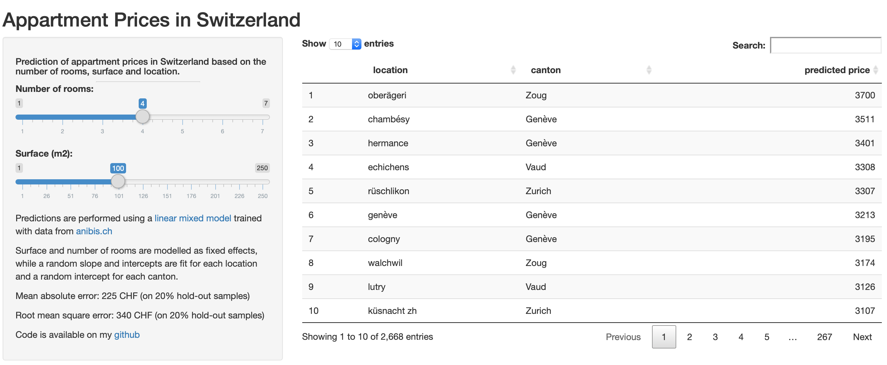

# Prediction of rent prices in Switzerland

This projects aims to predict monthly rent prices in Switzerland based on data from the [anibis.ch](https://www.anibis.ch/fr/immobilier-immobilier-locations--410/advertlist.aspx) website.

The structure of the project is the following:

1) A [python script](https://github.com/jbryois/SwitzerlandHousing/blob/master/Code/ParseAnibis.py) collects housing data from [anibis.ch](https://www.anibis.ch/fr/immobilier-immobilier-locations--410/advertlist.aspx) and performs some initial cleaning of the data.

2) An [R script](https://github.com/jbryois/SwitzerlandHousing/blob/master/Code/Anibis_immo_analysis.md) cleans the data further and evaluates different mixed models and machine learning models.

3) A [shiny app](https://jbryois.shinyapps.io/SwitzerlandHousingPred/) displays the predicted prices in Switzerland based on a linear mixed model.

